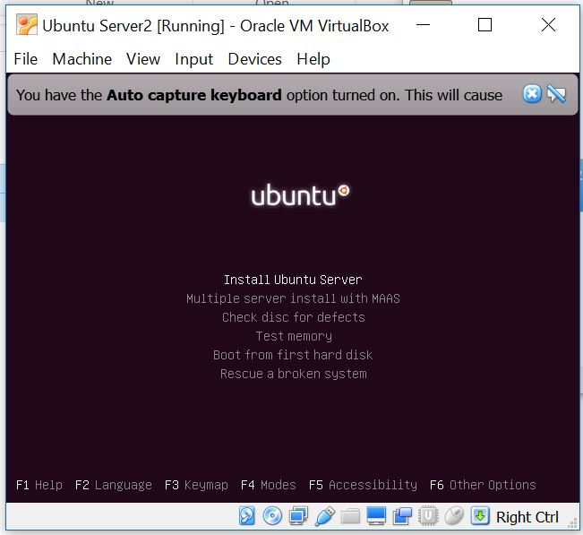
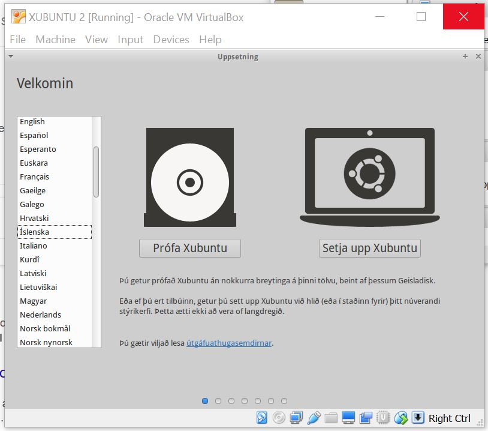
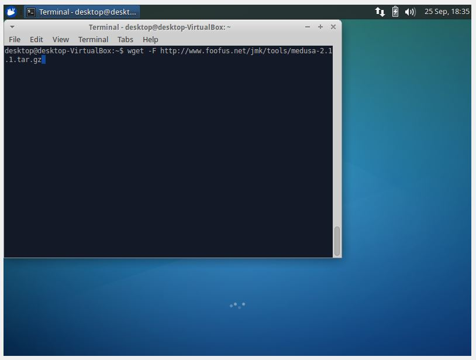
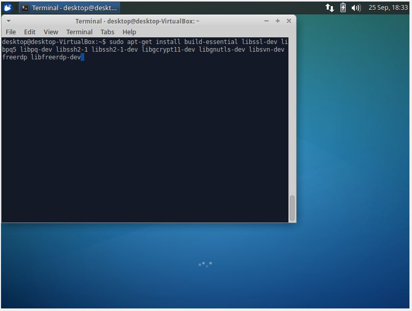
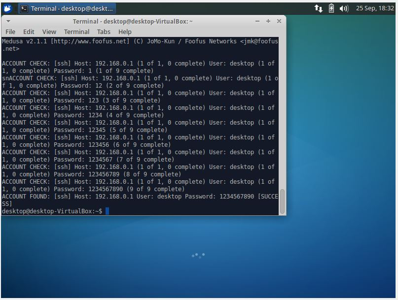

#TUGAS 1 PKSJ 2016
##Pendahuluan
Laporan ini dibuat sebagai tugas 1 dari mata kuliah Peracangan Keamanan dan Sekuritas Jaringan. Pada laporan ini terdapat penjelasan-penjelasan dan hasil percobaan peneterasi SSH yang kami lakukan. 
Laporan ini disusun oleh :
Setiyo Adiwicaksono		:5113100020
Fajar Ade Putra			:5113100092
Anwar Rosyidi			:5113100180

### Uji coba yang dilakukan
####Uji penetrasi 1 :
Instal sebuah virtual OS dengan Ubuntu server
Instal SSH server dengan konfigurasi default
Instal satu lagi virtual OS dengan OS bebas, misalnya Kali Linux atau Ubuntu Desktop
Pastikan tools untuk SSH brute force attack sudah terinstal
Lakukan uji penetrasi 1: dengan THC-Hydra atau Ncrack dan catat hasil uji penetrasi

#### Uji penetrasi 2 :
nstal fail2ban pada Ubuntu server yang telah diinstal SSH servernya
Konfigurasilah SSH server agar tidak default lagi
Lakukan uji penetrasi 2 dengan tools yang sama dan catat hasilnya


##Dasar Teori
### OS yang digunakan
1. Ubuntu Server 14.04 : Ubuntu server adalah ubuntu yang didesain untuk di install di server. Perbedaan mendasar, di Ubuntu Server tidak tersedia GUI. Jika anda menggunakan ubuntu server artinya anda harus bekerja dengan perintah perintah di layar hitam ayng sering disebut konsole. Jika anda datang dari windows, maka tampilan ubuntu server seperti DOS.

2. Xubuntu :Xubuntu adalah sebuah distribusi Linux dan varian resmi yang berbasiskan Ubuntu yang menggunakan lingkungan desktop Xfce. Xubuntu ditujukan untuk pengguna yang menggunakan komputer dengan kinerja rendah atau mereka yang mencari lingkungan meja yang lebih efisien pada komputer dengan kinerja tinggi.


###Tools yang digunakan
1. Medusa : Medusa adalah suatu aplikasi untuk melakukan bruteforce attacking ke server. Bekerja dengan cara mencoba satu persatu user name dan password hingga username dan password pada server ditemukan, jika entri username dan password sesuai dengan yang ada di server.

2. SSH Server :SSH adalah akronim dari Secure Shell yang merupakan sebuah protokol jaringan yang memanfaatkan kriptografi untuk melakukan komunikasi data pada perangkat jaringan agar lebih aman. Dalam konsepnya penggunaan SSH ini harus di dukung oleh server maupun perangkat atau komputer klien yang melakukan pertukaran data. Keduanya harus memiliki SSH server dari sisi komputer server dan SSH klien untuk komputer penerima (klien).

3. Fail2ban : adalah package keamanan yang digunakan untuk mencegah serangan brute-force dan DDoS pada linux. Fail2ban bekerja dengan memonitor jumlah kegagalan login untuk selanjutnya memblok ip address dari login yang gagal tersebut.

##Uji Penetrasi 1 
###Insatalasi Ubuntu server 
1. Pertama, silahkan install Virtualbox
2. Setelah install virtualbox, jalankan virtualbox, dan buat virtualisasi baru dan pilih sesuai dengan yang anda inginkan. Untuk kali ini, ubuntu server dibuat dengan alokasi penggunaan ram 1.5 GB, dan allokasi harddisk yang tetap sebesar 10 GB

	 Membuat virtualisasi baru
	
    Menentukan alokasi RAM
    
    Menetukan alokasi space hard disk
    
3. Setelah pembuatan Virtual box baru berhasil, silahkan pilih bootable ubuntu seperti gambar dibawah
	

4. Ikuti petunjuk instalasi seperti biasa, hingga ubuntu berhasil di install  	


###Insatalasi XUbuntu
1. Langkah pertama sama seperti instalasi ubuntu server kemudian ikuti petunjuk instalasi seperti biasa
	- Install Xubuntu
	- klik "Continue" untuk menyetujui jika Xubuntu akan mengambil space dari komputer
	- pilih  "something else" untuk mengatur sendiri partisi yang akan digunakan
	- New Partition Table
	- pilih partisi seperti install ubuntu sebelumnya untuk menentukan root dan swap area
	- pilih region
	- set username dan password
	- restart



###Langkah instalasi SSH server
Pada xubuntu yang telah diinstal, silahkan buka terminal dan masukkan sudo apt-get install open-ssh server, dan tunggu hingga instalasi selesai
```
sudo apt-get install open ssh server
```
###Langkah uji penetrasi menggunakan Medusa (Tools untuk SSH Brute Force Attack)
1. Untuk langkah pengujian, pertama silahkan install dependensi yang mendukung medusa agar bisa di install.
	
2.	Setelah itu, silahkan mulai install medusa seperti gambar dibawah
	
3.	Setelah instalasi medusa selesai, buatlah sebuah txt yang bisa dibaca oleh medusa dengan format :username:password
	
4.	Setelah itu, masukkan syntax medusa
```
–h [ip_host] –C [nama_file_buatan].txt –M ssh.
```
5. Lihat hasilnya, ketikahasil bruteforce menunjukan success, maka itulah username dan passwordnya
	