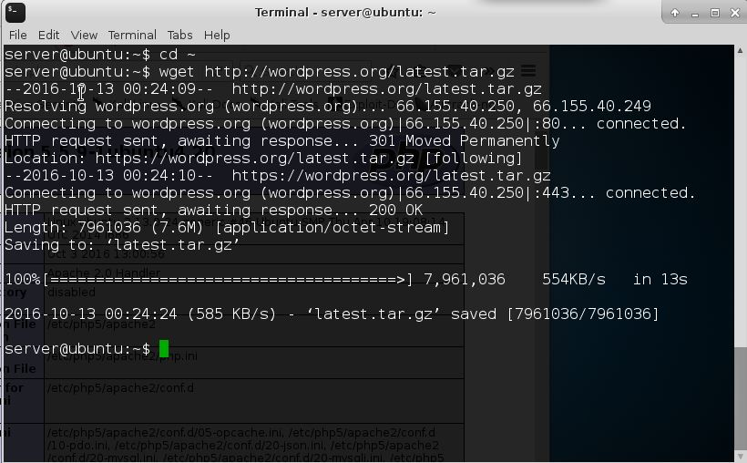
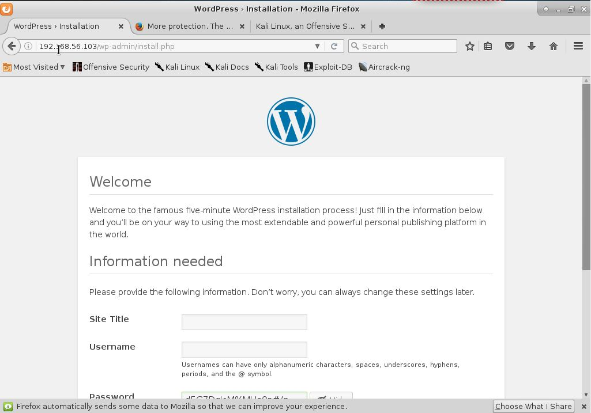

# Laporan Tugas 2 PKSJ
## Pendahuluan
Laporan ini dibuat sebagai tugas 2 dari mata kuliah Peracangan Keamanan dan Sekuritas Jaringan. Pada laporan ini terdapat penjelasan-penjelasan dan hasil percobaan SQL Injection yang kami lakukan. 
Laporan ini disusun oleh :
Setiyo Adiwicaksono		:5113100020
Fajar Ade Putra			:5113100092
Anwar Rosyidi			:5113100180

## Dasar Teori
### OS yan digunakan
1.  Ubuntu Server 14.04 : Ubuntu server adalah ubuntu yang didesain untuk di install di server. Perbedaan mendasar, di Ubuntu Server tidak tersedia GUI. Jika anda menggunakan ubuntu server artinya anda harus bekerja dengan perintah perintah di layar hitam ayng sering disebut konsole. Jika anda datang dari windows, maka tampilan ubuntu server seperti DOS.
2.   Kali Linux adalah generasi baru dari BackTrack Linux, pemimpin industri Penetration Testing dan audit keamanan distribusi Linux. Kali Linux merupakan pembangunan kembali dari BackTrack Linux dari dasar dan mengikuti sepenuhnya standar pengembangan Debian.

### Tools yang digunakan
1. SSH Server :SSH adalah akronim dari Secure Shell yang merupakan sebuah protokol jaringan yang memanfaatkan kriptografi untuk melakukan komunikasi data pada perangkat jaringan agar lebih aman. Dalam konsepnya penggunaan SSH ini harus di dukung oleh server maupun perangkat atau komputer klien yang melakukan pertukaran data. Keduanya harus memiliki SSH server dari sisi komputer server dan SSH klien untuk komputer penerima (klien).
2. Tolong ditambahkan

## Uji coba
## Instalasi Wordpress
1. Pertama, lakukan koneksi ssh dengan server
```
ssh server@192.168.56
```
2. Lakukan instalasi apache server
```
sudo apt-get install apache2
```


3. Install database mysql
```
sudo apt-get install mysql-server php5-mysql
```
```
sudo mysql_install_db
```
```
sudo mysql_secure_installation
```
4. Install PHP
```
sudo apt-get install php5 libapache2-mod-php5 php5-mcrypt
```
untuk mengetahui apabila php sudah terinstall silahkan buat file php di var/www/html/ 


5. Buat database untuk wordpress
- log in ke dalam mysql root
```
mysql -u root -p
```
-  Buat database wordpress
```
CREATE DATABASE wordpress;
```
- buat user untuk akses database
```
CREATE USER wordpressuser@localhost IDENTIFIED BY 'password';
```
- Berikan privileges akses kepada akun db yang kita buat
```
GRANT ALL PRIVILEGES ON wordpress.* TO wordpressuser@localhost;
```
```
FLUSH PRIVILEGES;
exit
```
## Download wordpress
1. Lakukan download wordpress dengan memasukan syntax
```
cd ~
wget http://wordpress.org/latest.tar.gz
```

2. Kemudian extract hasil download
```
tar xzvf latest.tar.gz
```
3. Install package yang diperlukan 
```
sudo apt-get update
sudo apt-get install php5-gd libssh2-php
```
## Konfigurasi wordpress
1. Buka directory wordpress
```
cd ~/wordpress
```
2. Membuat backup file config wordpress
```
cp wp-config-sample.php wp-config.php
```
3. buka wpconfig untuk melakukan konfigurasi database
```
nano wp-config.php
```


4. copy file yang ada pada directory wordpress ke document root
```
sudo rsync -avP ~/wordpress/ /var/www/html/
```
5. buka document root dan rubah ownership file wordpress
```
cd /var/www/html
sudo chown -R demo:www-data *
```
6. kemudian kita buat folder uploads pada document root dan rubah ownershipnya
```
mkdir /var/www/html/wp-content/uploads
sudo chown -R :www-data /var/www/html/wp-content/uploads
```
7. Selanjutnya lakukan konfigurasi dengan membuka halaman wordpress yang telah kita install


8. Proses instalasi selesai dan kita bisa membuka halaman wp-admin

### Hasil halaman wordpress yang berhasil diinstall


