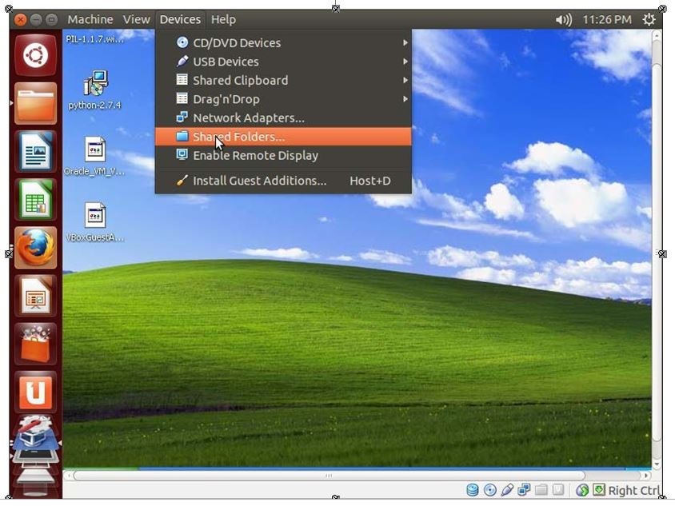
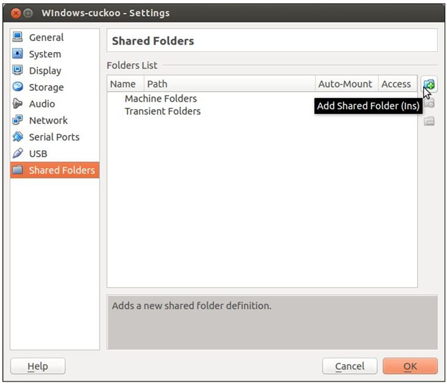
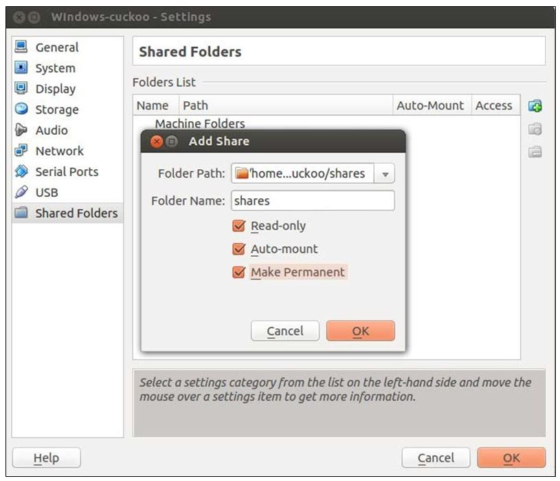

# Laporan Tugas 3 PKSJ
## Pendahuluan
Laporan ini dibuat sebagai tugas 3 dari mata kuliah Peracangan Keamanan dan Sekuritas Jaringan. Pada laporan ini terdapat penjelasan-penjelasan dan hasil percobaan Analisis Malware berformat Doc yang kami lakukan. 
Laporan ini disusun oleh :
Setiyo Adiwicaksono		:5113100020
Fajar Ade Putra			:5113100092
Anwar Rosyidi			:5113100180

##Dasar Teori
###OS yang digunakan
OS yang digunakan pada percobaan kali ini adalah ubuntu sebagai host OS, dan Windows XP sebagai guest OS. 
1. Ubuntu Desktop 14.04:
Ubuntu Versi 14.04 “Trusty Tahr” merupakan distribusi Linux yang paling populer menggunakan user interface Unity yang khas dan disesuaikan. Trusty Tahr merupakan edisi dengan dukungan jangka panjang “Long Term Support” (LTS) selama 5 tahun, berupa dukungan keamanan berikut jalur upgrade yang lebih mudah dibandingkan rilis versi LTS (12.04) sebelumnya.
2. Windows XP:
Windows XP adalah jajaran sistem operasi berbasis grafis yang dibuat oleh Microsoft untuk digunakan pada komputer pribadi, yang mencakup komputer rumah dan desktop bisnis, laptop, dan pusat media (Media Center)

###Tools yang Digunakan
1. Cuckoo
Adalah sebuah tools yang digunakan untuk melakukan malware analysis. Dasar dari Cuckoo ini adalah python
2. VirtualBox
Virtualbox adalah software milik Oracle yang fungsi utamanya adalah mem-visualisasi-kan sebuah atau banyak Sistem Operasi (OS) di dalam Sistem Operasi utama.

##Langkah Pengerjaan
###Instalasi Python
1. Pertama, silahkan install python pada Linux anda dengan cara
```
sudo apt-get install python
```
2. Lalu, cuckoo membutuhkan aplikasi SqlAlchemy, install dengan cara
```
sudo apt-get install python-sqlalchemy
sudo pip install sqlalchemy
```
3. Lalu silahkan instalasi aplikasi pendukung untuk pythonnya
```
sudo apt-get install python-dpkt python-jinja2 python-magic
python-pymongo python-libvirt python-bottle python-pefile ssdeep
sudo pip install dpkt jinja2 pymongo bottle pefile
sudo apt-get install build-essential git libpcre3 libpcre3-dev
libpcre++-dev
```
4. Lalu silahkan clone pydeep dari github 
```
cd /opt
git clone https://github.com/kbandla/pydeep.git pydeep
cd /opt/pydeep/
python setup.py build
sudo python setup.py install
```
5. Lalu perlu juga untuk menginstall yara
```
sudo apt-get install automake -y
cd /opt
svn checkout http://yara-project.googlecode.com/svn/trunk/yara
cd /opt/yara
sudo ln -s /usr/bin/aclocal-1.11 /usr/bin/aclocal-1.12
./configure
make
sudo make install
cd yara-python
python setup.py build
```
6. Lalu install tcpdump
```
sudo apt-get install tcpdump
```
7. Ubah hak akases file tcpdump dengan cara di bawah
```
sudo chmod +s /usr/sbin/tcpdump
```

###Konfigurasi Cuckoo Sandbox di Host OS

1. Pertama silahkan download cuckoo sandbox pada http://www.cuckoosandbox.org/download.html
2. Sebelum mengkonfigurasi cuckoo, pastikan setting guest os terlebih dahulu pada virtualbox, karena akan digunakan untuk mengkonfigurasi cuckoo
3. Sebelum memulai konfigurasi virtualbox, silahkan jalankan perintah di bawah untuk mengetahui vbox driver
```
uname –a
```
akan muncul hasi seperti di bawah
"Linux digit-labs 3.5.0.17-generic #28-ubuntu SMP Tue Oct 9 19:31:23 UTC
2012 x86_64x86_64 x86_64 x86_64 GNU/Linux"

maka silahkan install kernel sesuai versinya
```
apt-get install linux-headers-3.5.0.17-generic
```
Ketika dijalankan command ini, maka akan muncul hasil seperti di bawahnya
```
$ sudo /etc/init.d/vboxdrv setup
* Stopping VirtualBox kernel modules [OK]
* Recompiling VirtualBox kernel modules [OK]
* Starting VirtualBox kernel modules [OK]
```
Jika semua sudah **OK**, maka silahkan persiapkan guest os dengan menginstall virtualiasasi seperti biasanya.

###Setting shared folder antara Host dan Guest
1. Di Guest OS silahkan klik **Device** option dan pilih **Shared Folders**

2. Lalu silahkan klik tombol hijau di pojok kanan atas, yang berfungsi untuk **Add Shared Folder**

3. Silahkan pilih folder destinasi di Host OS yang ingin diintegrasikan dengan Guest OS di **Folder Path**
4. Berikan folder integrasi tersebut dengan sebuah nama, dan silahkan pilioh opsi sharing nya sesuai dengan keinginan anda

5. Lalu pada windows Guest OS, pilih Start, klik kanan pada bagian **My Computer**, dan pilih **Map network device**
6. Pilih drive yang diinginkan
7. Padqa bagian folder, silahkan isi **\\vboxsrv\shares** (**shares** adalah nama shared folder yang tadi sudah diberi nama)
8. Lalu masuk ke **Computer** / **Windows Explorer**, dan akan terlihat shared foldernya
9. Lalu pada bagian Guest OS lakukan langkah berikut:
- Install Python (http://python.org/download/)
- Install PIL (http://www.pythonware.com/products/pil/)
- Matikan automatic windows update
- Matikan windows firewall
- Install aplikasi third-party (Microsoft Office 2003)
10. Lalu copy python agent ke windows shared folder dengan mengkopi command di bawah
```
cp /home/digit/cuckoo/agent/agent.py /home/digit/cuckoo/shares/
```
11. Di windows Guest OS, copy **agent.py** ke **C:\Python27** folder
12. Rename **agent.py** menjadi **agent.pyw**


