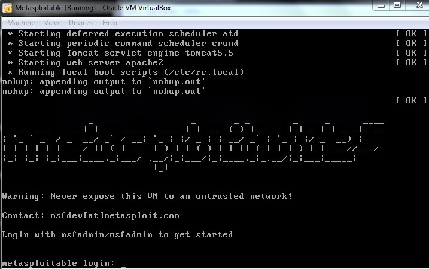
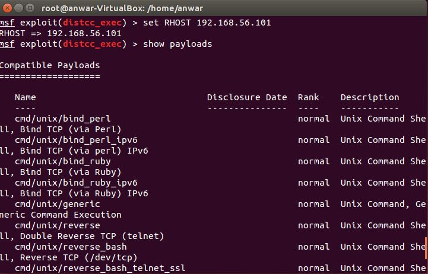

# Laporan Tugas 5 PKSJ
## Pendahuluan
Laporan ini dibuat sebagai tugas 5 dari mata kuliah Perancangan Keamanan dan Sekuritas Jaringan (PKSJ). Pada laporan ini terdapat penjelasan-penjelasan dasar teori dan hasil percobaan mengamati serangan Metasploit terhadap Metasploitable. Laporan ini 
disusun oleh :
- Setiyo Adiwicaksono : 5113100020
- Fajar Ade Putra : 5113100092
- Anwar Rosyidi : 5113100180

## Dasar Teori

### OS yang digunakan
1. Ubuntu 14.04 : Merupakan sebuah distribusi Linux yang berbasiskan pada Debian dan memiliki interface desktop yang didistribusikan menjadi perangkat lunak sistem operasi opensource. Ubuntu disponsori oleh Canonical Ltd (perusahaan milik Mark Shuttleworth).

### Tool yang digunakan
1. Metasploit
Sebuah aplikasi security yang digunakan untuk menguci coba ketahanan sebuah sistem dengan mengexploitasi kelemahan sebuah software, tool ini banyak digunakan dalam bidang hacking dan juga IT Security mulai dari para pemula sampai ke yang sudah ahli dalam jaringan.

2. Metosploitable
Mesin seperti virtual Linux. VM ini dapat digunakan untuk melakukan pelatihan keamanan, alat tes keamanan, dan praktek penetrasi Versi pengujian umum teknik ini 2 dari mesin virtual yang tersedia untuk di-download dari Sourceforge dan kapal dengan kerentanan bahkan lebih dari gambar asli.

## Langkah Pengerjaan

### Instalasi Metasploit
1. sebelum kita menginstall Metasploit kita harus update dan upgrade sistem Linux dengan cara mengetikkan pada terminal perintah berikut:
```
sudo apt-get update
sudo apt-get upgrade
```

2. Selelah itu lakukan penginstalan paket metasploit framework sebagai berikut:
```
sudo apt-get install build-essential libreadline-dev libssl-dev libpq5 libpq-dev libreadline5 libsqlite3-dev libpcap-dev openjdk-7-jre git-core autoconf postgresql pgadmin3 curl zlib1g-dev libxml2-dev libxslt1-dev vncviewer libyaml-dev curl zlib1g-dev
```

3. Setelah melakukan pengistalan paket diatas, maka langkah selanjutnya adalah mengintall metasploit:
```
cd /opt
sudo git clone https://github.com/rapid7/metasploit-framework.git
sudo chown -R `whoami` /opt/metasploit-framework
cd metasploit-framework
gem install bundler
bundle install
```

4. Untuk mempermudah pemanggilan Metasploit di Terminal bisa melakukan perintah berikut di Terminalnya:
```
sudo bash -c 'for MSF in $(ls msf*); do ln -s /opt/metasploit-framework/$MSF /usr/local/bin/$MSF;done' 
```

5. Selanjutnya menginstall Metasploit guinya yaitu armitage
```
curl -# -o /tmp/armitage.tgz http://www.fastandeasyhacking.com/download/armitage-latest.tgz
sudo tar -xvzf /tmp/armitage.tgz -C /opt
sudo ln -s /opt/armitage/armitage /usr/local/bin/armitage
sudo ln -s /opt/armitage/teamserver /usr/local/bin/teamserver
sudo sh -c "echo java -jar /opt/armitage/armitage.jar \$\* > /opt/armitage/armitage"
sudo perl -pi -e 's/armitage.jar/\/opt\/armitage\/armitage.jar/g' /opt/armitage/teamserver
```
Metasploit Telah terinstall dan dapat digunakan.

###Instalasi Metasploitable
1. Pada Virtual Box Create New


2. Atur ukuran memori


3. Pada Hardisk pilih sesuai gambar dibawah


4. Pengistalan Metasploitable telah selesai, silakan jalankan Virtual Machinenya, makan tampilanya sebagai berikut:


##Uji coba penetrasi
### 1. distcc_exec
Pada percobaan penetrasi ini akan dilakukan exploit dengan modul exploit distcc_exec dan dengan tujuna untuk mendapat ssh key dari komputer target. langkah-langkahnya ialah sebagai berikut :
1. Buka aplikasi metaspolit pada terminal pc

2. Cari lokasi modul distcc_exec dengan menegetikan`search distcc_exec`

3. untuk menggunakan modul distcc_exec gunakan perintah `use` disambung dengan path dari modul yang akan digunakan

4. Setting alamat ip target dengan menggunakan perintah `set RHOST <Alamat ip>`

5. Pilih payload yang ingin digunakan dan untuk melihat payload yang tersedia gunakan perintah `show payloads`

6. Set payloads yang ingin digunakan pada percobaa ini digunakan payload bind_perl

7 Jalankan perintah exploit dengan mengetikan `exploit`

8. kita sudah masuk ke komputer target untuk memeriksa pakah kita sudah masuk gunakan perinah `whoami`

9. untuk mengetahui ssh key dari komputer target gunakan perintah `cat /root/.ssh/authorized_keys`


### PHP CGI Argument Injection
Dengan modul ini kita bisa mengakses folder var/www dari komputer target. langkah-langkah untuk melakukannya ialah sebagai berikut.
1. Buka aplikasi metaspolit pada terminal pc

2. gunakan perintah `use` untuk masuk ke modul

3. Lihat target yang bisa dipake dan set targetnya

4. Set target dengan menggunakan `RHOST`

5. lakukan exploit dan kita akan memiliki akses ke folder var/www


